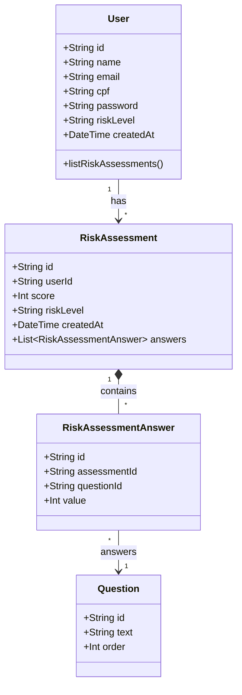
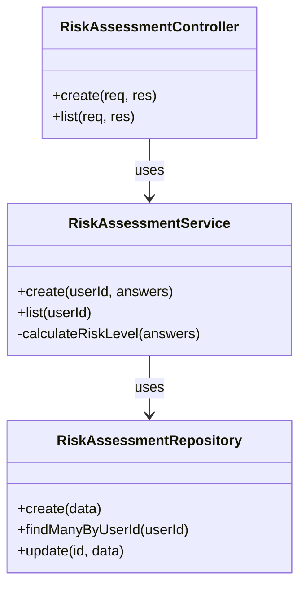

# Diagramas de Classe - Frida API

## Diagrama de Classes Principal (Domínio Risco e Usuário)

```mermaid
classDiagram
    class User {
        +String id
        +String name
        +String email
        +String cpf
        +String password
        +String riskLevel
        +DateTime createdAt
        +listRiskAssessments()
    }

    class RiskAssessment {
        +String id
        +String userId
        +Int score
        +String riskLevel
        +DateTime createdAt
        +List~RiskAssessmentAnswer~ answers
    }

    class RiskAssessmentAnswer {
        +String id
        +String assessmentId
        +String questionId
        +Int value
    }

    class Question {
        +String id
        +String text
        +Int order
    }

    User "1" --> "*" RiskAssessment : has
    RiskAssessment "1" *-- "*" RiskAssessmentAnswer : contains
    RiskAssessmentAnswer "*" --> "1" Question : answers
```

## Relacionamento entre Service e Repository (Arquitetura Atual)

```mermaid
classDiagram
    class RiskAssessmentController {
        +create(req, res)
        +list(req, res)
    }

    class RiskAssessmentService {
        +create(userId, answers)
        +list(userId)
        -calculateRiskLevel(answers)
    }

    class RiskAssessmentRepository {
        +create(data)
        +findManyByUserId(userId)
        +update(id, data)
    }

    RiskAssessmentController --> RiskAssessmentService : uses
    RiskAssessmentService --> RiskAssessmentRepository : uses
```
