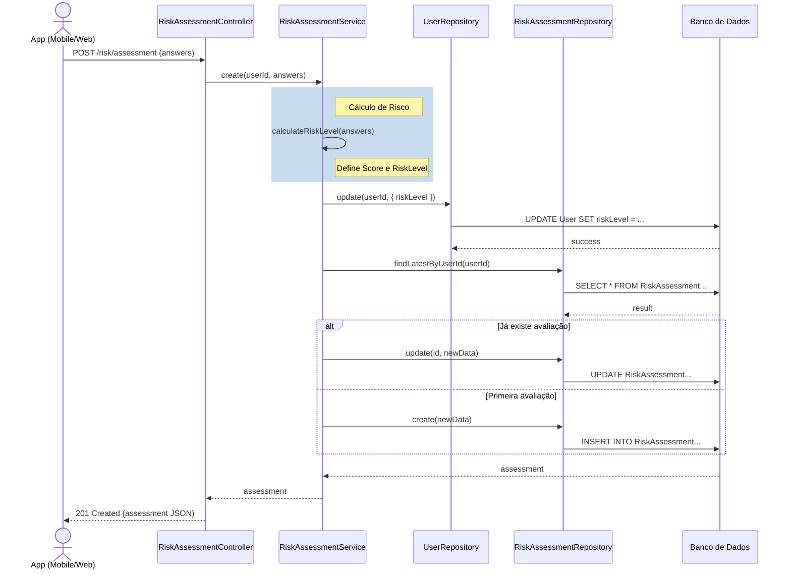

# Diagramas de Sequência - Frida API

## Fluxo de Avaliação de Risco (Risk Assessment)

Este fluxo descreve o processo quando uma usuária submete suas respostas para o questionário de risco.

```mermaid
sequenceDiagram
    actor App as App (Mobile/Web)
    participant Controller as RiskAssessmentController
    participant Service as RiskAssessmentService
    participant UserRepo as UserRepository
    participant RiskRepo as RiskAssessmentRepository
    participant DB as Banco de Dados

    App->>Controller: POST /risk/assessment (answers)
    Controller->>Service: create(userId, answers)

    rect rgb(200, 220, 240)
        Note right of Service: Cálculo de Risco
        Service->>Service: calculateRiskLevel(answers)
        Note right of Service: Define Score e RiskLevel
    end

    Service->>UserRepo: update(userId, { riskLevel })
    UserRepo->>DB: UPDATE User SET riskLevel = ...
    DB-->>UserRepo: success

    Service->>RiskRepo: findLatestByUserId(userId)
    RiskRepo->>DB: SELECT * FROM RiskAssessment...
    DB-->>RiskRepo: result

    alt Já existe avaliação
        Service->>RiskRepo: update(id, newData)
        RiskRepo->>DB: UPDATE RiskAssessment...
    else Primeira avaliação
        Service->>RiskRepo: create(newData)
        RiskRepo->>DB: INSERT INTO RiskAssessment...
    end

    DB-->>Service: assessment
    Service-->>Controller: assessment
    Controller-->>App: 201 Created (assessment JSON)
```
